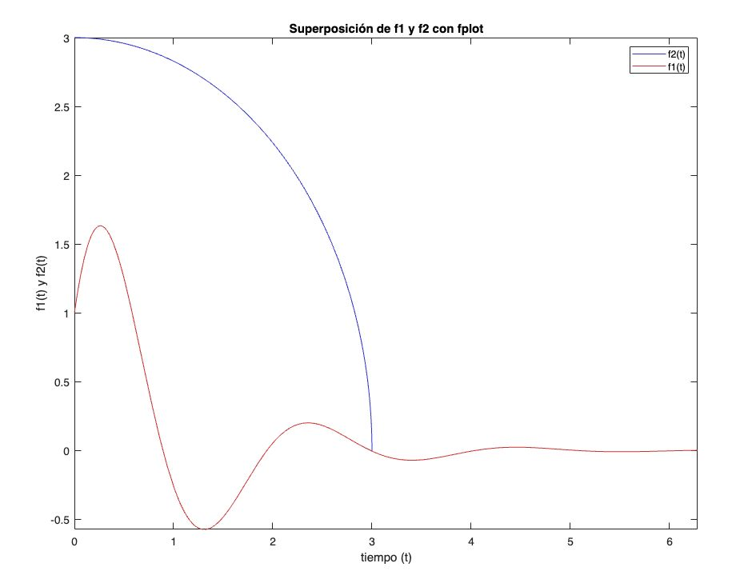

# Graficación de funciones en MATLAB

Este repositorio contiene un script en MATLAB para generar y graficar funciones matemáticas usando las funciones `plot` y `fplot`. Se incluyen también imágenes de las gráficas generadas.

## Descripción del Código

El script `graficar_funciones.m` contiene el código MATLAB necesario para definir y graficar dos funciones matemáticas, \( f_1(t) \) y \( f_2(t) \), utilizando las funciones `plot` y `fplot`.

## Imágenes de las Gráficas

A continuación se muestran las imágenes de las gráficas generadas por el script:

### Gráficas de \( f_1(t) y f_2(t) \) con `plot`

### Superposición de \( f_1(t) \) y \( f_2(t) \) con `plot`

### Superposición de \( f_1(t) \) y \( f_2(t) \) con `fplot`

